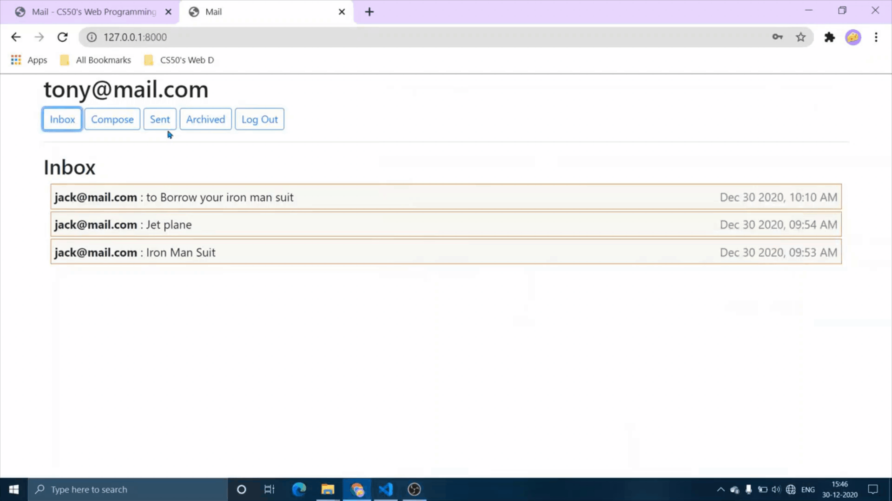
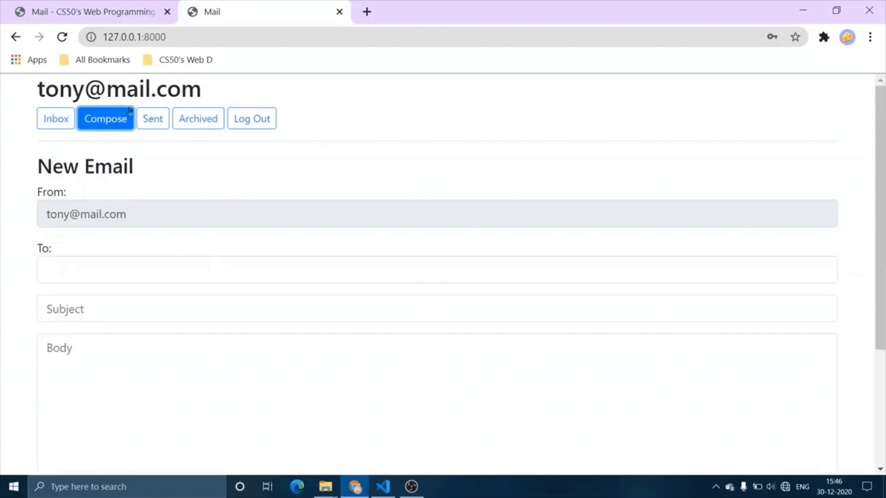
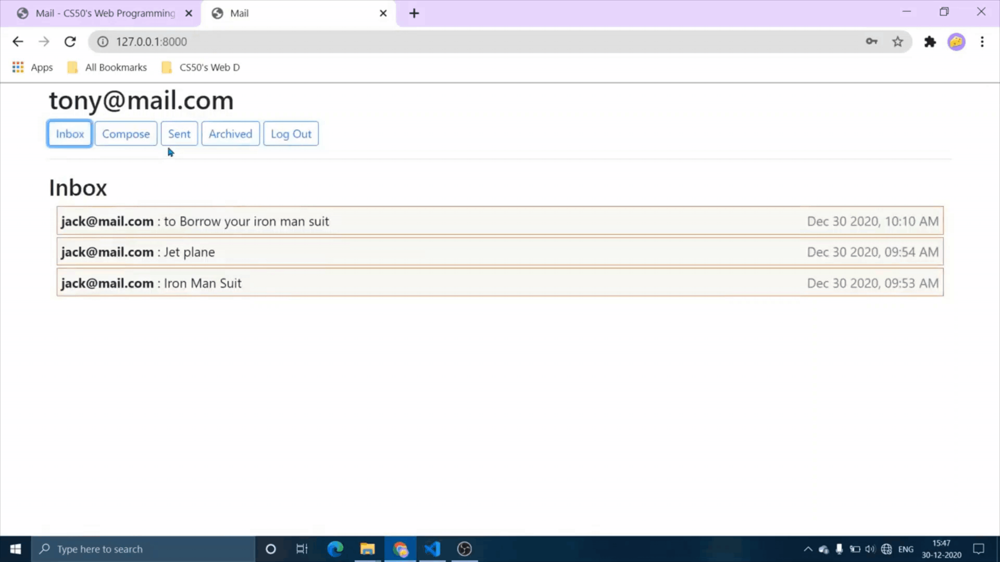
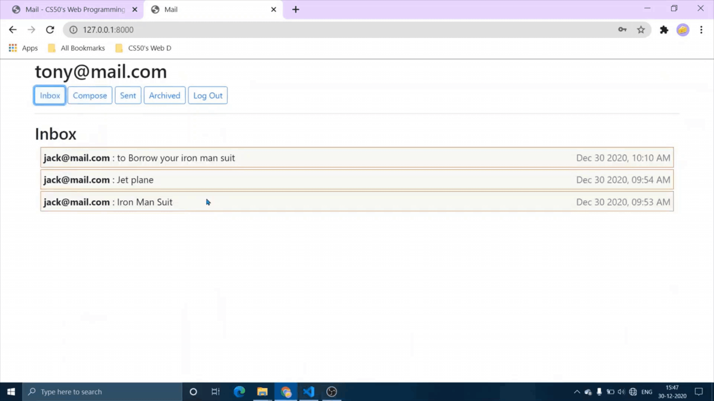

# Mail
Design a front-end for an email client that makes API calls to send and receive emails.

## Overview
Mail is the third project for Harvard CS50's Web Programming with Python and JavaScript course.
The project specifications are listed [here](https://cs50.harvard.edu/web/2020/projects/3/mail/).

## Project Demos
A [full demo of my project](https://youtu.be/fhThIVbBSXM) can be viewed on YouTube along with all [other CS50 Web Projects](https://www.youtube.com/playlist?list=PL6kIwIV_2O_gfcx46gplsaybo8c9vTb3d).

Note the quality of the following clips may be lower due to conversion from video to GIF format. 

### All mails

### Compose New mail

### Reply to a mail

### Archive the mail

### Recieved and reply

## Bug Reports and Improvements
If you experience any bugs or see anything that can be improved or added, please feel free to [open an issue](https://github.com/IrfanTheDev/Mail/issues) <!-- update the link --> here or simply contact me through any of the methods below.
 Thanks in advance!

Email: theirfan2020@gmail.com   
Linkedin: [https://www.linkedin.com/in/theirfanr/](https://www.linkedin.com/in/theirfanr/)

